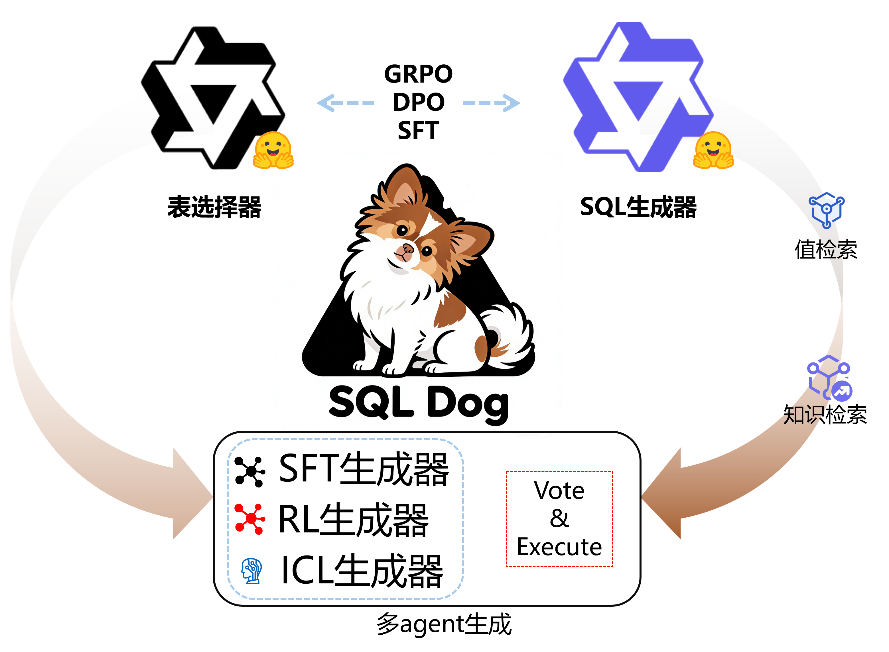

# 🐕 SQL Dog - 智能问数助手


<p align="center">
  <h1>SQL Dog - 智能问数助手</h1>
  <p>基于 DeepSeek 大语言模型的 Text-to-SQL 对话系统</p>
  <p>
    <a href="https://www.modelscope.cn/models/GDUTSONG/SQL_Dog_DPO" target="_blank"></a>
    <a href="https://github.com/qcjySONG/SQL_dog" target="_blank"></a>
  </p>
</p>

## 📋 目录

- [功能特点](#功能特点)
- [系统架构](#系统架构)
- [技术栈](#技术栈)
- [快速开始](#快速开始)
- [API 接口](#api-接口)
- [项目结构](#项目结构)
- [核心模块](#核心模块)
- [日志与调试](#日志与调试)
- [License](#license)

---

## 功能特点

- 🤖 **智能对话**：基于 DeepSeek 大语言模型，将自然语言转换为 SQL 查询
- 🔄 **多轮对话**：支持多轮对话，保持上下文连贯性，可引用历史查询结果
- 🎯 **意图识别**：自动识别闲聊（chat）和问数（query）意图，分流处理
- 🧠 **智能表选择**：基于 Token 分块的并行表识别，支持多路召回
- 🔍 **检索路由**：
  - **值检索**：Faiss + BM25 混合检索数据库具体值（疾病名、药物名等）
  - **知识库检索**：业务术语定义、计算公式、指标含义等外部知识
- 🔧 **错误修复**：SQL 执行错误时自动修复（最多3次）
- 📊 **结果展示**：表格形式展示查询结果
- 💾 **对话持久化**：自动保存对话历史，支持回顾和选择
- 📝 **思维链展示**：展示 AI 的思考过程，提高透明度
- ⚡ **步骤耗时显示**：实时显示意图识别、表选择、SQL生成各阶段耗时
- 🎨 **现代化 UI**：三栏布局（历史对话 / 聊天区域 / Schema与日志）

---

## 系统架构

```
┌─────────────────────────────────────────────────────────────────┐
│                    现代 Web 前端 (HTML/JS)                        │
│  ┌─────────────┐  ┌──────────────────────┐  ┌───────────────┐  │
│  │  历史对话列表 │  │    聊天区域          │  │ Schema/进度/日志│ │
│  │  (左栏)     │  │    (中栏)            │  │   (右栏)      │  │
│  └─────────────┘  └──────────────────────┘  └───────────────┘  │
└──────────────────────────┬──────────────────────────────────────┘
                           │ HTTP REST API
                           ▼
┌─────────────────────────────────────────────────────────────────┐
│                    FastAPI 后端服务 (端口 7863)                   │
│  ┌────────────────────────────────────────────────────────────┐ │
│  │  /api/chat        - 聊天接口                                │ │
│  │  /api/conversations - 对话历史列表                         │ │
│  │  /api/conversation/{id} - 获取指定对话                     │ │
│  │  /api/schema      - 数据库 Schema                          │ │
│  │  /static/         - 静态文件 (Logo等)                      │ │
│  └────────────────────────────────────────────────────────────┘ │
└──────────────────────────┬──────────────────────────────────────┘
                           │
                           ▼
┌─────────────────────────────────────────────────────────────────┐
│                    LangGraph 状态机 (Agent)                      │
│                                                                 │
│  ┌──────────────┐    ┌──────────────┐    ┌──────────────────┐  │
│  │ 意图识别节点  │───▶│ 表选择节点    │───▶│  检索路由节点    │  │
│  └──────────────┘    └──────────────┘    └────────┬─────────┘  │
│                                                    │            │
│  ┌──────────────┐    ┌──────────────┐    ┌────────▼─────────┐  │
│  │  闲聊节点    │    │ SQL生成节点   │◀───│ 检索结果注入      │  │
│  └──────────────┘    └──────┬───────┘    └──────────────────┘  │
│                             │                                   │
│                    ┌────────▼─────────┐                        │
│                    │  SQL执行工具     │                        │
│                    │  (SQLite Engine) │                        │
│                    └────────┬─────────┘                        │
│                             │                                   │
│                    ┌────────▼─────────┐                        │
│                    │  错误修复节点    │◀── 执行失败时触发       │
│                    │  最多3次重试     │                        │
│                    └──────────────────┘                        │
└─────────────────────────────────────────────────────────────────┘
                           │
                           ▼
┌─────────────────────────────────────────────────────────────────┐
│                        数据层                                     │
│  ┌─────────────┐  ┌──────────────┐  ┌──────────────────────┐   │
│  │ SQLite DB   │  │ DDL 缓存     │  │ Faiss 向量索引 + BM25 │   │
│  │ (mimic_iv)  │  │ (JSON)       │  │ (值检索 + 知识库)     │   │
│  └─────────────┘  └──────────────┘  └──────────────────────┘   │
└─────────────────────────────────────────────────────────────────┘
```

---

## 技术栈

### 后端
- **FastAPI** - 现代 Python Web 框架
- **Uvicorn** - ASGI 服务器
- **LangGraph** - 多 Agent 状态机
- **SQLite** - 数据库

### 前端
- **HTML5 + JavaScript** - 原生开发
- **TailwindCSS** - 样式框架

---

## 快速开始

### 1. 配置 API Key

本项目推荐使用 **ModelScope（魔搭）** API，每天免费调用额度足够练习使用。

#### 注册魔搭账号
1. 访问 [ModelScope 魔搭](https://www.modelscope.cn/docs/model-service/API-Inference/intro)
2. 注册账号并完成实名认证
3. 在个人中心获取 API Key

#### 配置环境变量

创建 `.env` 文件（从 `.env.example` 复制）：

```bash
cp .env.example .env
```

编辑 `.env`，填入你的 API Key：

```bash
MODELSCOPE_API_KEY=your-modelscope-api-key-here
MODELSCOPE_BASE_URL=https://api-inference.modelscope.cn/v1
MODELSCOPE_MODEL=Qwen/Qwen3-30B-A3B-Instruct-2507

# Embedding 模型（如需使用检索功能）
EMBEDDING_API_KEY=your-modelscope-api-key-here
EMBEDDING_MODEL=Qwen/Qwen3-Embedding-0.6B
```

### 3. 启动后端服务

```bash
cd SQL_Dog

# 激活 conda 环境
source envs/sql_dog/bin/activate

# 启动 FastAPI 服务
nohup python -m uvicorn backend.main:app --host 0.0.0.0 --port 7863 > uvicorn.log 2>&1 &
```

### 4. 访问服务

- 前端页面: http://localhost:7863/
- API 文档: http://localhost:7863/docs

---

## API 接口

### 基础信息
- **Base URL**: `http://10.21.76.239:7863`
- **协议**: HTTP REST API

### 接口列表

| 方法 | 路径 | 描述 |
|------|------|------|
| GET | `/` | 返回前端页面 |
| GET | `/api/health` | 健康检查 |
| GET | `/api/schema` | 获取数据库 Schema |
| GET | `/api/conversations` | 获取对话历史列表 |
| GET | `/api/conversation/{id}` | 获取指定对话 |
| POST | `/api/chat` | 发送聊天消息 |
| GET | `/static/{file}` | 静态文件 |

### 聊天接口详情

**请求**
```json
POST /api/chat
{
  "message": "统计患者数量",
  "conversation_id": "可选的对话ID"
}
```

**响应**
```json
{
  "conversation_id": "对话ID",
  "answer": "最终回答",
  "sql": "生成的SQL语句",
  "result": {
    "success": true,
    "row_count": 10,
    "data": [...]
  },
  "intent": "query|chat",
  "selected_tables": ["patients", "admissions"],
  "history": [...],
  "timings": {
    "intent": 2.1,
    "table": 0.8,
    "sql": 3.2,
    "total": 6.1
  }
}
```

---

## 项目结构

```
SQL_Dog/
├── backend/
│   └── main.py          # FastAPI 后端主程序
├── frontend_dist/
│   └── index.html       # 前端页面
├── src/
│   ├── agent.py         # LangGraph 状态机
│   ├── config.py       # 配置文件
│   ├── conversation_manager.py  # 对话管理
│   ├── database.py     # 数据库操作
│   ├── prompts.py      # 提示词模板
│   ├── retrieval_router.py  # 检索路由
│   └── table_selector.py   # 表选择器
├── assets/
│   └── sql_dog_logo.jpg  # Logo 图片
├── logs/
│   └── sql_dog.log     # 运行日志
└── README.md           # 本文件
```

---

## 核心模块

### backend/main.py
FastAPI 后端服务，负责：
- 处理 HTTP 请求
- 调用 LangGraph Agent
- 管理对话历史
- 返回标准化 JSON 响应

### src/agent.py
LangGraph 状态机，负责：
- 意图识别 (query/chat)
- 表选择
- 检索路由
- SQL 生成与执行
- 错误修复

### frontend_dist/index.html
现代 Web 前端，负责：
- 三栏布局展示
- 实时聊天交互
- 思维链折叠展示
- 结果表格化展示

---

## 日志与调试

### 查看日志

```bash
# 查看后端日志
tail -f /tmp/uvicorn.log

# 查看应用日志
cat /amax/storage/nfs/qcjySONG/SQL_Dog/logs/sql_dog.log
```

### 前端调试

按 F12 打开浏览器控制台，查看 Network 和 Console 中的请求和响应。

---

## License

MIT License
