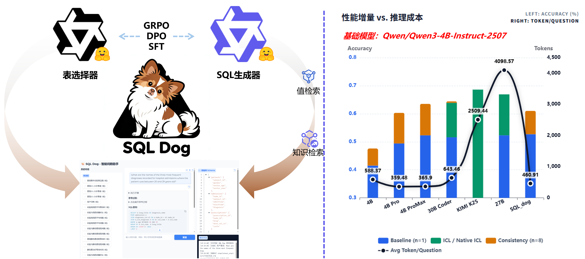

# 通过蒸馏提升小型语言模型的Text-to-SQL推理能力


本项目仅是一个小小的分享，用于提供给大家去尝试在LLM上进行SFT等后训练算法。由于是一个分享项目，仅使用了4B的小模型+一个开源的医疗数据库来方便大家复现——这一定能够体现工业场景，但是绝对是没有达到能够应用的程度。
- 它的作用不是真正的帮你突破LLM上下文限制让你可以塞入几千几万列；
- 它的作用更不是帮你理解一些可能你们公司资深人员都理解不了的数据库结构，
- 没有人敢保证100%的正确率（除非是一些套壳小公司骗你钱的），即便是算命大师。

## 项目提供内容清单
- 所有后训练过的模型和完整的测试代码
- 训练集和测试集
- 完整的CoT蒸馏代码（考虑到蒸馏非常烧钱，仓库内提供了完整的蒸馏后的数据集）

> 此处由于使用的是开源数据集，其本身包括了（问题，SQL）对，因此本次并不包含从数据库合成SQL的代码（合成属于自己业务的训练数据其实也是最难的一部分）
> 对于测试集，我采用“并集筛选”原则：只要某个样本至少被一个模型正确回答，我就将其选入测试数据。早期的数据标注都比较抽象，这是我能够最大化去偏的方法。
> 这个项目提供的一切不适合于BIRD、Spider这两个广泛使用的开源数据集，它们一定程度上各种各样的数据泄露比较严重，在Qwen3上SFT性能反而会下降。

### 相关文档
PDF中介绍了详细的合成数据、CoT和Prompt组织这些小的细节，更详细的细节得等对应的paper发出来（虽然是Paper，但是一定程度上像技术报告）
- [SQL_dog项目介绍](../assets/SQL_dog.pdf)

## 后训练结果
全程仅在单张3090上使用Unsloth进行了两轮SFT后训练，完整复现仓库后模型的性能如4B_Pro所示（名字我随便起的）。
> 4B_ProMax是我本人使用相同的数据和后训练方法训练得出的(没有调参)，**仅是在训练时往Prompt中注入约10个Token左右的内容即可带来进一步的性能提升**，这也表明了SFT是无法完全激发小模型的能力的。

## 复现
### 测评结果复现
```bash
cd model_train
# 使用 uv 安装依赖（uv 是更快的 pip 替代工具）
uv pip install -r requirements.txt

# 安装 modelscope（如果尚未安装）
uv pip install modelscope

# 下载模型到指定目录,你可以需要更改./MODEL/Qwen3_4B
modelscope download --model GDUTSONG/SQL_Dog_DPO \
    --local_dir ./MODEL/SQL_Dog_DPO

python Evaluation_EHR.py
```


### 后训练过程复现
下面的要求24GB，如果要16GB的进去让LLM调成QLora，生成的模型也在Post-training文件夹下面。
```bash
python Post-training/FT.py
```

### 蒸馏CoT过程复现
> 如果你恰巧财力雄厚，才建议去折腾；如果没有Boss提供蒸馏的Token费用又想折腾，一个简单便宜的方法即为使用4B_ProMax去蒸馏（有单卡3080以上都可），因为4B_ProMax是这个仓库中最熟悉这个数据库最强的模型。

TBD，待定

## 合成数据代码
> 如果你恰巧财力雄厚或者真正有需要，才建议去折腾，因为合成了数据又要合成CoT才能够形成完整的训练过程，非常非常烧Token。

TBD，待定

## 其它附加资料

- 评测脚本（与BIRD-SQL的评测脚本不同，我们采用了一个更加宽松现代的评测脚本）：https://github.com/qcjySONG/test-suite-sql-eval_2026
- 所有的评测结果和输出内容（不包括Long CoT）：
- 参考内容：DeepSeek-R1论文、OmniSQL。
- 感谢魔搭，没有它的免费API调用，很多事情都难以完成。

## 项目启发

- 后训练的模型在**速度方面依旧有着一定的优势**：尽管我们可以观察到，简单的ICL即可让模型的正确率大幅度提升，但是其的CoT长度（对应即为延迟的体现）仍然远超后训练的模型。如果是在追求速度的场景，后训练仍然是值得考虑的。
- 紧接着，随着LLM的agent能力越来越强，是否需要使用后训练在真实的工作中确实需要去衡量，一个判断标准是你使用了agent各种工具调用后（生成，验证，迭代）其总延迟能否和目前的推理模型的延迟保持相同的水平。尽管R1的延迟确实已经非常夸张了。
- 不使用CoT（无论是Long CoT or Short CoT）之后，只输出一条SQL语句，其确实会更快，但是个人尝试下来确实SQL语法错误的次数会增加，并且正确率会相应的下降，考虑现实情况，还是推荐使用Short CoT。
- 为什么我要坚持结构化CoT：我想了很久，和大多数面试官扯的是信任度，只有少部分我会说推理能力这些。


## 工程落地
- 参考DB-GPT，XIYAN-SQL，他们人多力量大，顶得住大家压力，这个仓库并没有做好工程的想法。
- 但是我仍然建议大家做好了数据治理才考虑接入LLM，就和RAG一样，需要做好前序的文档整理才去考虑召回率准确率。
